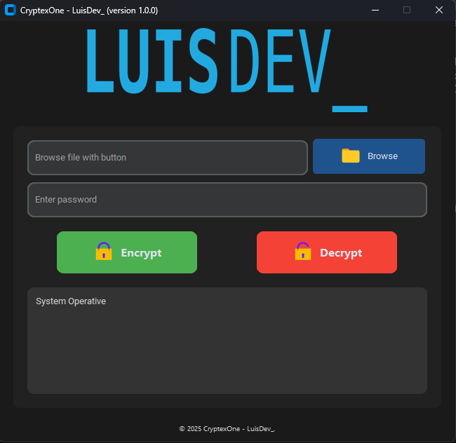

# 🔐 CryptexOne

**CryptexOne** is a modern file encryption and decryption app with a stylish graphical interface, built using Python and CustomTkinter.  
It uses a secure **multi-platform hybrid encryption algorithm** based on AES and PBKDF2.


---

## 🚀 Features

- 🧠 **Hybrid AES Encryption** with SHA-512 file signing
- 🔒 **Password-based encryption** using PBKDF2 + salt
- 📁 User-friendly file browser and password input
- 📊 Real-time progress bar and logs
- 🌓 Dark-themed modern GUI with icons
- 🧰 Fully packaged as `.exe` (via PyInstaller + Inno Setup)

---

## 🖥️ GUI Preview



---

## 🛠 Installation (from source)

### ✅ Requirements

- **Python 3.10+** (recommended: 3.11 or 3.12)
- Install required packages:
  
```bash
pip install customtkinter tkinterdnd2 pillow cryptography
```
---
## 💻 Running the App

```bash
python cryptex_gui.py

```
### Create Standalone Executable (.exe)
To compile CryptexOne into a Windows executable with no Python dependency:
- Install PyInstaller:

```bash
pip install pyinstaller
```
- Run the following command using the provided .spec file:
```bash
python -m PyInstaller cryptex_gui.spec
```
- The output .exe will be found in the dist/CryptexOne/ folder.

---

### 📦 Create a Custom Installer (Inno Setup)
We recommend using Inno Setup to create a professional installer.
- The installer.iss script is provided in `dist/CryptexOne/`.
- Customize and compile it with the Inno Setup Compiler.

### 📁 Project Structure
```bash
CryptexOne/
│
├── cryptex_gui.py          # Main application script
├── cryptex_gui.spec        # PyInstaller config
├── images/                 # All icons and graphics
│   ├── banner.png
│   ├── folder.png
│   ├── enc.png
│   ├── dec.png
│   └── logo.ico
├── dist/                   # PyInstaller output
├── README.md               # This file
```

---

## 🔐 License
MIT License © 2025 — LuisDev_

## 🙌 Credits
- GUI: CustomTkinter
- Cryptography: cryptography

